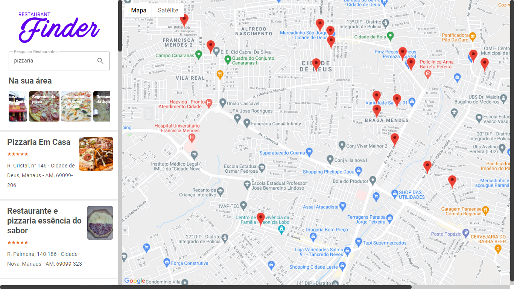

  

<h1 align="center">
    
</h1>

## :memo: Project

Restaurant finder near your current location, with support for locating restaurants using the map. Also, just click on a place to find out more details about.

## :computer: Technologies used

:pushpin: Javascript

:pushpin: React

:pushpin: Redux

:pushpin: Styled Components

:pushpin: Google Cloud Platform

:pushpin: Netlify (deploy)

## :cloud: App

You can access the application through the link below:

- [Restaurant Finder](https://restaurant-finder-v999.netlify.app/)

:man_technologist: Made with :heart: by Tiago Santos.
